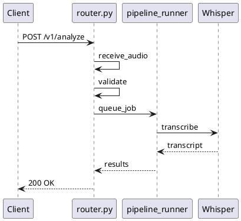

# Architecture Annotation Schema

## Overview
Embed `@arch` annotations in code comments to define architecture metadata.
The generator extracts these + AST info to produce `architecture-data.json`.

## Python Annotations

### Component Declaration
```python
# @arch component=router layer=api
# @arch depends=[pipeline_runner, job_manager, auth]
# @arch description="All API endpoints"
```

### Flow Steps (for sequence diagrams)
```python
# @arch.flow analyze_speech
# @arch.step 1: receive_audio "Receive audio blob from client"
# @arch.step 2: validate_input "Check file type and size"
# @arch.step 3: queue_job "Submit to job_manager"
# @arch.step 4: return_job_id "Return job ID to client"
def analyze_speech(audio: UploadFile):
    ...
```

### Inline Step Markers (for log correlation)
```python
def analyze_speech(audio: UploadFile):
    # @arch.trace analyze_speech.receive_audio
    logger.info("ARCH:analyze_speech.receive_audio")  # Log marker
    data = await audio.read()
    
    # @arch.trace analyze_speech.validate
    logger.info("ARCH:analyze_speech.validate")
    validate(data)
```

## Dart/Flutter Annotations

### Screen Component
```dart
/// @arch component=ResultsScreen layer=app type=screen
/// @arch depends=[APIService, CoachService]
/// @arch description="Analysis results display"
class ResultsScreen extends StatelessWidget {
```

### UI Regions (for phone mockup)
```dart
/// @arch.region ScoreGauge {x:25, y:10, w:50, h:25, style:gauge}
/// @arch.region.desc "Animated circular score display"
Widget _buildScoreGauge() { ... }

/// @arch.region MetricsGrid {x:5, y:38, w:90, h:20}
/// @arch.region.desc "WPM, pitch, clarity metrics"
Widget _buildMetrics() { ... }
```

### Service Component
```dart
/// @arch component=APIService layer=app type=service
/// @arch depends=[AuthService]
/// @arch external=[dio, flutter_secure_storage]
class APIService {
```

## Log Format for Runtime Tracing

API logs should include trace markers:
```
2024-02-17 00:10:15 INFO ARCH:analyze_speech.receive_audio request_id=abc123
2024-02-17 00:10:15 INFO ARCH:analyze_speech.validate request_id=abc123
2024-02-17 00:10:16 INFO ARCH:pipeline.start request_id=abc123
2024-02-17 00:10:18 INFO ARCH:whisper.transcribe request_id=abc123
2024-02-17 00:10:22 INFO ARCH:pipeline.complete request_id=abc123
```

The log parser groups by request_id and generates PlantUML sequence diagrams.

## Generated Output

### architecture-data.json
```json
{
  "components": {
    "ResultsScreen": {
      "layer": "app",
      "type": "screen",
      "depends": ["APIService", "CoachService"],
      "regions": [
        {"name": "ScoreGauge", "x": 25, "y": 10, "w": 50, "h": 25, "style": "gauge"}
      ]
    }
  },
  "flows": {
    "analyze_speech": {
      "steps": [
        {"id": 1, "name": "receive_audio", "desc": "Receive audio blob"},
        {"id": 2, "name": "validate", "desc": "Check file type and size"}
      ]
    }
  }
}
```

### Sequence Diagram (from logs)

